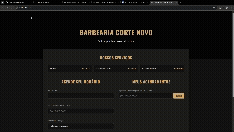

# 💈 Sistema de Agendamento para a Barbearia "Corte Novo"

## 📝 Descrição Geral

Este projeto é um sistema web completo para agendamento de horários na barbearia "Corte Novo". A plataforma foi desenvolvida para oferecer uma experiência de usuário moderna e intuitiva, permitindo que clientes visualizem os serviços, escolham um profissional, e agendem um horário de forma rápida e eficiente.

O sistema conta com uma interface de cliente para agendamento e consulta, e uma área administrativa para o gerenciamento completo dos horários pela equipe da barbearia.

---

## ✨ Funcionalidades Principais

### Para Clientes:
*   **Visualização de Serviços:** Página inicial com a apresentação de todos os serviços oferecidos e seus respectivos preços.
*   **Agendamento Inteligente:** Um calendário interativo que permite ao cliente escolher a data e o horário, mostrando apenas os horários disponíveis e respeitando o expediente da barbearia (Segunda a Sábado, das 07h às 20h).
*   **Consulta e Cancelamento:** O cliente pode buscar seus agendamentos futuros usando seu número de telefone e, se necessário, cancelá-los diretamente pela interface.
*   **Validação de Formulário:** Validações em tempo real para garantir que os dados inseridos (nome, telefone, data) sejam válidos, prevenindo erros.

### Para Administradores (`/admin.html`):
*   **Painel de Controle:** Uma visão geral de todos os agendamentos em uma tabela clara e organizada.
*   **Gerenciamento de Status:** O administrador pode marcar um agendamento como "Concluído".
*   **Cancelamento de Agendamentos:** Permite ao administrador cancelar qualquer agendamento diretamente pelo painel.

---

## 🚀 Tecnologias Utilizadas

Este projeto foi construído utilizando uma stack moderna e robusta, dividida em três componentes principais:

*   **Frontend:**
    *   **HTML:** Para a estrutura semântica das páginas.
    *   **CSS:** Para o design moderno, responsivo e estilização do calendário.
    *   **JavaScript :** Para a interatividade, manipulação do DOM, validações e comunicação com a API (via `fetch`).
    *   **Flatpickr.js:** Uma biblioteca leve e poderosa para a criação do calendário de agendamento interativo.

*   **Backend:**
    *   **Node.js:** Ambiente de execução para o servidor.
    *   **Express.js:** Framework para a construção da API RESTful, gerenciamento de rotas e middlewares.
    *   **CORS:** Middleware para permitir requisições de origens diferentes (essencial para o deploy).
    *   **Dotenv:** Para o gerenciamento seguro de variáveis de ambiente.

*   **Banco de Dados:**
    *   **PostgreSQL:** Um sistema de gerenciamento de banco de dados relacional robusto e confiável.
    *   **node-postgres (pg):** Driver para a comunicação entre a aplicação Node.js e o banco de dados PostgreSQL.

---

## ⚙️ Como Executar o Projeto Localmente

Siga os passos abaixo para rodar o projeto em sua máquina.

### Pré-requisitos:
*   [Node.js](https://nodejs.org/) (versão 14 ou superior)
*   [PostgreSQL](https://www.postgresql.org/download/) instalado e rodando.
*   [Git](https://git-scm.com/downloads)

### Passos:

1.  **Clone o repositório:**
    ```bash
    git clone https://github.com/seu-usuario/nome-do-repositorio.git
    cd nome-do-repositorio
    ```

2.  **Instale as dependências do backend:**
    ```bash
    npm install
    ```

3.  **Configure o Banco de Dados:**
    *   Crie um banco de dados no PostgreSQL (ex: `barbearia_db`).
    *   Execute o script SQL presente em `database.sql` (você pode criar este arquivo com os comandos `CREATE TABLE`) para criar as tabelas `servicos`, `clientes` e `agendamentos`.

4.  **Configure as Variáveis de Ambiente:**
    *   Na raiz do projeto, crie um arquivo chamado `.env`.
    *   Copie o conteúdo do arquivo `.env.example` (se houver) ou adicione as seguintes variáveis, substituindo pelos seus dados:
      ```.env
      DB_HOST=localhost
      DB_PORT=5432
      DB_USER=seu_usuario_postgres
      DB_PASSWORD=sua_senha_postgres
      DB_DATABASE=barbearia_db
      PORT=5000
      ```

5.  **Inicie o servidor:**
    ```bash
    node server.js
    ```
    O servidor estará rodando em `http://localhost:5000`.

6.  **Acesse a aplicação:**
    *   **Página do Cliente:** Abra seu navegador e acesse `http://localhost:5000`.
    *   **Painel do Administrador:** Acesse `http://localhost:5000/admin.html`.

🎥 Demonstração

Abaixo, uma breve demonstração das principais funcionalidades do sistema, incluindo o agendamento pelo cliente e o gerenciamento pelo painel administrativo.


)

---

## 👥 Integrantes do Grupo

*   [Bernardo Pozzebon Poluceno]
